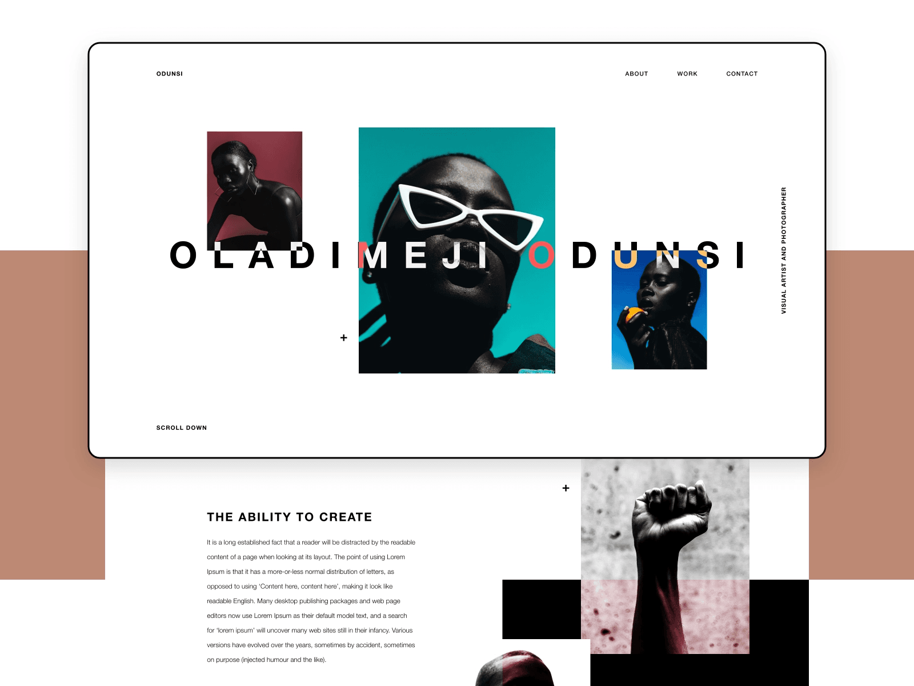

# [Gatsby/SCSS/GSAP] Oladimeji Odunsi Photography Portfolio

> Little project inspired in a HTML, SCSS and Media Queries series by [ Raddy The Brand Youtube](https://youtu.be/Q2BSNTfhGsw)

Website deployed at Vercel.com - [** Oladimeji Odunsi Portfolio - https://none.none/**](https://none.none/)

---

## 🚀 Quick start

1.  **Clone this repo or simple download it.**

    Clone the master branch of this repo:

    ```shell
    # clone master repo
    git clone -b https://github.com/clovis-rosa/oladimeji-odunsi-portfolio.git
    ```

2.  **Start developing.**

    Navigate into your new site’s directory and start it up.

    ```shell
    cd raddy-responsive-design/
    yarn install
    yarn start
    ```

3.  **Open the source code and start editing!**

    Your site is now running at `http://localhost:8000`!

## 🧐 What's inside?

A quick look at the dependencies amd resources:

- Bootstrapped with [Gatsby CLI](https://www.gatsbyjs.org/docs/).
<!-- - [include-media](https://github.com/eduardoboucas/include-media) Maintainable media queries in SASS -->

## 💫 Deploying

- I recommend to use either [Zeit Now](https://now.sh) or [Netlify](https://netlify.com) for hosting your site.

---

Screenshots:


---

## 📖 License

- This project is licensed under [the terms of the MIT license](LICENSE).
